# 要件定義

## サービス概要
出退勤報告、1日予定作業報告等をワンクリックでチャットツール(Slack)に自動投稿したり、
社員の業務状況を一覧で管理し繰り返し業務連絡を自動化してくれるサービス。

## 目的
毎日同じフォーマットで同じ連絡または報告をするというメッセージ入力作業を短縮して、
自分の作業に時間をあてることで業務効率化の向上を狙う。
また、チーム内のコミュニケーションの向上をはかり、円滑なコミュニケーションを目指す。

## 背景
チャットワークが当たり前になった世の中で、日々の業務報告や挨拶などを直接口頭でやりとりしていたが、
現在はチャットツール無しでは仕事が成り立たなくなり業務連携も難しくなった。チャット内でのやりとりが段々と増えていく中で、
日々の業務報告、出退勤、離席する度にチャットで連絡しなければならなくなった。
そういった連絡また報告を毎度繰り返し同じ文章を入力するのは非常に非効率なため、問題視すべきと思った。
また、リモートワークでの悩みとして、出勤後、普段は他の会社員の出勤状況がすぐ把握できたが今は自宅で仕事をするようになったため、
周りの状況がわかりにくくなり、都度確認しなければならなくなった。
上記のような、リモートでの問題や悩みを解決するため、今回のサービスを作成する経緯に至った。

## システム化の範囲
- 出退勤メッセージの連絡
- 出勤後の予定作業内容の報告
- 退勤前後の報告

## 現状の業務フロー(サンプル)

## システム化後の業務フロー

## 全体像

## 機能一覧

- ログイン機能
- ログアウト機能
- プロフィール閲覧機能
- プロフィール編集機能
- 勤怠管理機能
- 一覧機能
- 業務連絡メッセージ管理機能
  * 投稿機能
  * 編集機能
  * 一覧機能
- 作業報告メッセージ管理機能
  * 投稿機能　
  * 編集機能
  * 一覧機能

## 画面一覧
### ログイン前画面
- ユーザーログイン画面

### ログイン後画面
- プロフィール画面
- プロフィール編集画面
- 勤怠管理一覧画面
- 業務連絡メッセージについて
  * 編集画面
  * 一覧画面
  * 投稿画面
- 作業報告メッセージについて
  * 編集画面
  * 一覧画面
  * 投稿画面

## 外部連携
- チャットツール: Slack
- カレンダーツール: Googleカレンダー
- 勤怠システム: TODO

## 非機能要件
- ３つの外部連携ツールを拡張する前提で設計する。
